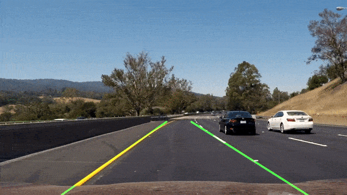

# Lane detection

[](LICENSE) [](https://www.codacy.com/manual/frgfm/sdcnd-p1-lane-detection?utm_source=github.com&amp;utm_medium=referral&amp;utm_content=frgfm/sdcnd-p1-lane-detection&amp;utm_campaign=Badge_Grade) [](https://circleci.com/gh/frgfm/sdcnd-p1-lane-detection)

This repository is an implementation of non-learning pipeline for the lane detection project of Udacity Self-Driving Car Nanodegree.




## Table of Contents

- [Getting Started](#getting-started)
  - [Prerequisites](#prerequisites)
  - [Installation](#installation)
- [Usage](#usage)
- [Credits](#credits)
- [License](#license)


## Getting started

### Prerequisites

- Python 3.6 (or more recent)
- [pip](https://pip.pypa.io/en/stable/)

### Installation

You can install the project requirements as follows:

```shell
git clone https://github.com/frgfm/sdcnd-p1-lane-detection.git
cd sdcnd-p1-lane-detection
pip install -r requirements.txt
```


## Usage

All script arguments can be found using the `--help` flag:

```shell
python main.py --help
```

Below you can find an example to detect lanes in an image and in a video:

```shell
python main.py test_images/whiteCarLaneSwitch.jpg
python main.py test_videos/challenge.mp4 --video
```


## Credits

This implementation is vastly based on the following papers:

- [Colorspaces](https://en.wikipedia.org/wiki/HSL_and_HSV)
- [Canny edge detection](https://opencv-python-tutroals.readthedocs.io/en/latest/py_tutorials/py_imgproc/py_canny/py_canny.html)
- [Hough transform](https://en.wikipedia.org/wiki/Hough_transform)


## License

Distributed under the MIT License. See `LICENSE` for more information.