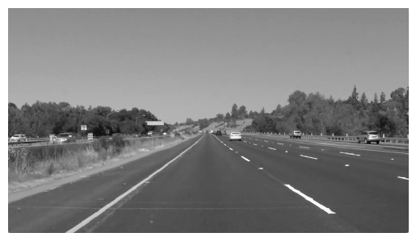
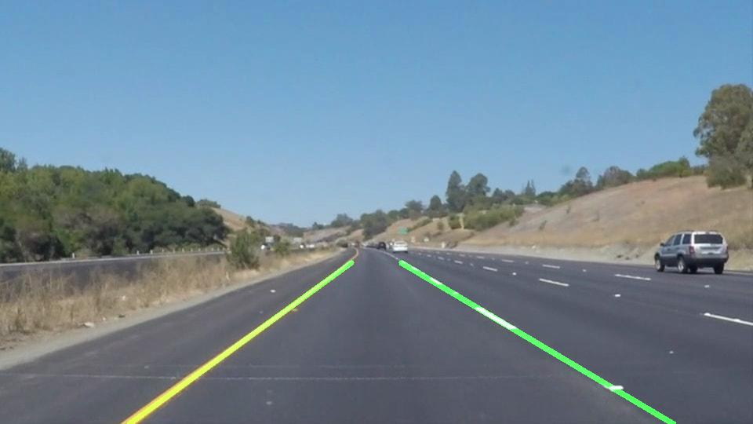

# Lane detection

[](LICENSE) [](https://www.codacy.com/manual/frgfm/sdcnd-p1-lane-detection?utm_source=github.com&amp;utm_medium=referral&amp;utm_content=frgfm/sdcnd-p1-lane-detection&amp;utm_campaign=Badge_Grade) [](https://circleci.com/gh/frgfm/sdcnd-p1-lane-detection)

This repository is an implementation of non-learning pipeline for the lane detection project of Udacity Self-Driving Car Nanodegree (cf. [repo](https://github.com/udacity/CarND-LaneLines-P1)).


## Table of Contents

- [Getting Started](#getting-started)
  - [Prerequisites](#prerequisites)
  - [Installation](#installation)
- [Usage](#usage)
- [Approach](#Approach)
- [Credits](#credits)
- [License](#license)


## Getting started

### Prerequisites

- Python 3.6 (or more recent)
- [pip](https://pip.pypa.io/en/stable/)

### Installation

You can install the project requirements as follows:

```shell
git clone https://github.com/frgfm/sdcnd-p1-lane-detection.git
cd sdcnd-p1-lane-detection
pip install -r requirements.txt
```


## Usage

All script arguments can be found using the `--help` flag:

```shell
python main.py --help
```

Below you can find an example to detect lanes in an image and in a video:

```shell
python main.py test_images/whiteCarLaneSwitch.jpg
python main.py test_videos/challenge.mp4 --video
```


## Approach

This detection approach was designed to avoid a learning procedure and only require sensor calibration for detection threshold.


Exploring multiple samples from road driving footage, one can notice that lanes can vary:

- in shape: continuous lines or dashed lines mostly
- in color: in white or yellow mostly

Since the testing samples from [repo](https://github.com/udacity/CarND-LaneLines-P1) include these variations, our detection system needs to handle them.


### Colorspace selection

First, we try to see if some colorspace are more advantageous than others in regards to specific lane variations.

**RGB**


RGB being the colorspace humans are sensible to, since we can clearly distinguish white lanes from yellow lanes, using filtering, we can isolate both lane colors separately.


**Grayscale**



Grayscale is a projection of RGB into a single channel, this is a colorspace where it is extremely easy to filter pixel values. In multiple channel colorspaces, the process would be trickier. Here we can notice that white lanes have significantly higher values than yellow lanes. Additionally, yellow lanes seem to have similar projection in grayscale as other present colours which can be an issue.


**HSV & HLS**


In both those colorspaces, we can easily notice that the Hue channel can help isolate yellow lanes.


Now, using the grayscale at high values (above 200) to isolate the white lanes and the hue channel from HSV or HLS at low values (under 20) to isolate the yellow lanes, we can produce the following single-channel image:


To avoid computation overhead, we will not use this colorspace projection and stick to HSV filtering for now.


### Canny edge detection

Using the selected colorspace, we apply Gaussian blur to use canny edge detection (gradient intensity based) to retrieve rough edges, as shown below:


### Depth view masking

Before going further, consider the fixed viewing angle of the camera, we can set a view masking taking depth and horizon into consideration. Setting a margin at the bottom, like below, will help handle cases where the hood of the car can be seen on the footage.


### Hough transform

Now that we have filtered local data, we need to go from points to lines. For this we use the Hough transform, which change the parameter space to detect lines.


*Source: Thales Sehn Körting*

After performing this, using the slope, position and other post-processing methods, we extrapolate the numerous lines into two clean lanes:


### Result

The end result is shown below, we can note that the lane fitting is not perfect but our approach consider lanes to be perfect lines. However, with perspective, the assumption is not verified.




## Credits

This implementation is vastly based on the following papers:

- [Colorspaces](https://en.wikipedia.org/wiki/HSL_and_HSV)
- [Canny edge detection](https://opencv-python-tutroals.readthedocs.io/en/latest/py_tutorials/py_imgproc/py_canny/py_canny.html)
- [Hough transform](https://en.wikipedia.org/wiki/Hough_transform)


## License

Distributed under the MIT License. See `LICENSE` for more information.